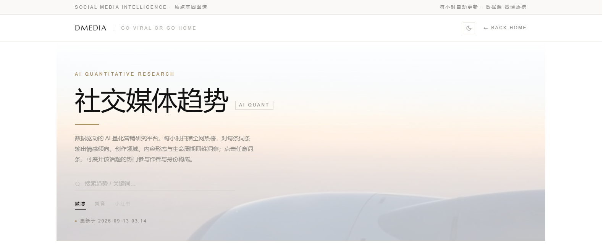
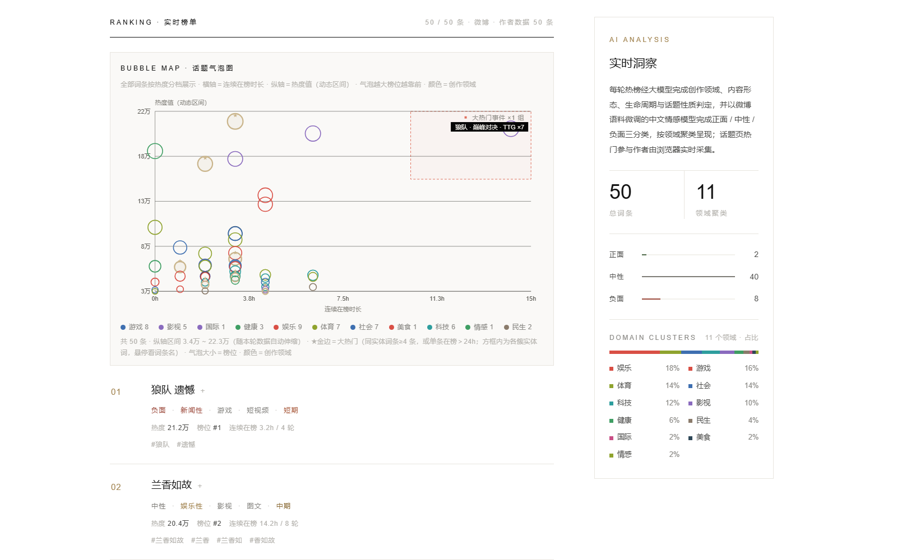
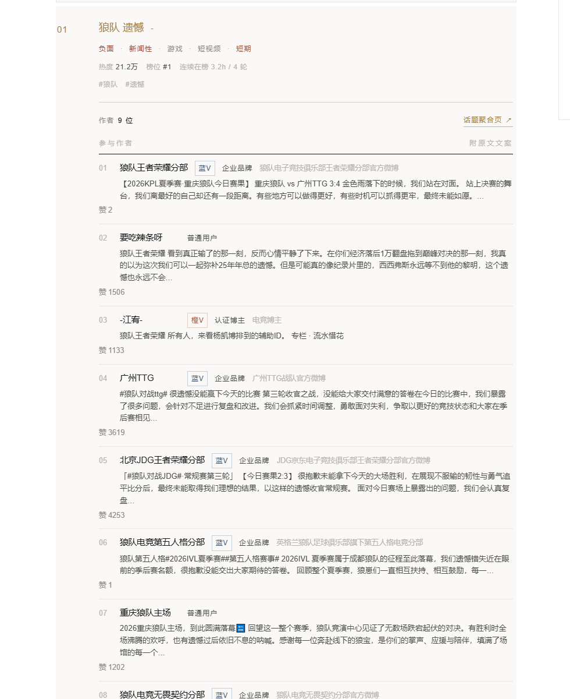

# DMEDIA — 量化营销平台

> 媒介即信息，信息创造价值。

一个数据驱动的量化营销工作室展示站。纯静态 HTML，零构建依赖，可直接部署到 GitHub Pages。

**在线地址**：https://demonoo.github.io/

---

## 社交媒体趋势 · Social Trends

站点核心功能：**每小时自动抓取微博 / 抖音热榜，由 AI 完成多维度标注，渲染成一张可交互的趋势页**（`trends.html`）。

### 页面总览

顶部为品牌 hero（含背景视频、关键词搜索与平台切换），下方是实时榜单与 AI 洞察面板：



### 话题气泡图 + AI 实时洞察

50 条词条按「热度 × 在榜时长」排布成气泡图，颜色 = 创作领域，气泡越大热度越高。
关联词条（同一事件的不同表述）由大模型聚类后，自动框出**大热门事件**（右上角红色虚线框），
悬停气泡可查看词条详情；右侧面板实时统计情感分布与领域占比：



每条词条由大模型标注五类标签：**情感倾向 / 创作领域 / 内容形态 / 生命周期 / 核心话题词**，
搜索框支持按词条、标签、关键词实时过滤。

### 话题参与作者

点击任意词条可就地展开该话题的**热门参与作者**（前 10 位），标注身份类型
（媒体 / 官方机构 / 企业品牌 / 认证博主 / 普通用户）、认证等级（金 V / 红 V / 橙 V / 蓝 V）与互动热度：



### 数据是怎么来的（GitHub Actions 全自动）

```
每小时（微博 :13 / 抖音 :28，自链式调度 + cron 兜底）
  ├─ 抓取热榜          fetch.py        微博 50 条 / 抖音 ~49 条
  ├─ 情感三分类        sentiment.py    本地微调小模型（senlou），不经大模型
  ├─ 热点基因分析      analyze.py      Agnes 2.5 Flash，全量实时、无缓存
  ├─ 话题参与作者      authors.py      headless Chrome + CDP 访客态采集
  └─ 校验 + 提交       data/*.json     逐个 JSON 校验，损坏文件不提交
```

- 全流程跑在 GitHub Actions 的免费 runner 上，**零服务器、零费用**
- 任一环节失败自动跳过、下一轮补齐；整轮成功率 < 50% 时保留上一份完整数据
- 数据文件：`data/hotspots.json`（微博）、`data/douyin_hotspots.json`（抖音），
  情感 `sentiment.json`、作者 `authors.json`、历史 `history.json`

---

## 目录结构

```
dmedia-site/
├── index.html          # 首页
├── about.html          # 创始人页
├── trends.html         # 社交媒体趋势（核心功能页）
├── reports/            # 报告页（每篇自包含，可独立分享）
│   ├── 全球社交媒体上的奥德赛时期.html
│   └── 中国电动汽车营销趋势报告.html
├── data/               # CI 自动更新的热榜数据（前端直接 fetch）
├── scripts/            # 数据管线（fetch / sentiment / analyze / authors）
├── .github/workflows/  # 每小时定时分析（hotspot-weibo / hotspot-douyin）
├── assets/             # 图片 / 视频 / 截图素材
├── models/             # 情感分析本地模型
└── fonts/              # 自定义字体
    └── Marcellus-Regular.ttf
```

## 首页板块

- **LLM SEARCH** — 基于大语言模型的搜索
- **CONTENT CREATOR** — 内容创作支持
- **MACHINE LEARNING** — 机器学习技术应用
- **KOL VALUE** — 关键意见领袖价值评估

## 技术要点

- **字体**：品牌字（DMEDIA）与英文大标题用衬线体 `Marcellus`（`@font-face` + preload），
  其余文字（含中文）全部走 Arial 字体链
- **主题**：三页共享 `assets/theme.js`，暗夜 / 白昼双主题（`data-theme` + localStorage），默认暗夜
- **报告预览**：首页卡片使用静态首屏截图（`assets/*-preview.jpg`，无头 Chrome 生成），
  图片仅 ~50-100KB，不加载整份报告
- **动效**：滚动 reveal、ticker、气泡图悬停均支持 `prefers-reduced-motion` 降级
- **数据新鲜度**：趋势页数据每小时由 CI 自动刷新并提交，Pages 随之重新部署
- **部署友好**：全部使用相对路径，GitHub Pages 根路径或子路径部署均可用

## 本地预览

页面会 fetch `data/*.json`，必须走 http（`file://` 不行）：

```bash
python -m http.server 8899
# 打开 http://127.0.0.1:8899/
```

## 部署到 GitHub Pages

```bash
git push origin main
# Settings → Pages → Source 选 main / (root)
```

## 自定义

- 颜色 / 主题变量 → 各页 `:root` 与 `[data-theme="light"]`
- 四大板块内容 → 搜索 `pillar-title`
- Ticker 文案 → 各 `section-ticker` 的 `data-ticker` 属性
- 报告卡片 → 搜索 `hero-report-card`
- 气泡图 / 大热门判定 → `trends.html` 内 `BUBBLE` 渲染与聚类逻辑

## 新增一篇报告

1. 把报告 HTML 放入 `reports/`（自包含样式，便于独立分享）
2. 用无头 Chrome 生成首屏封面到 `assets/<name>-preview.jpg`
3. 在 `index.html` 的 `.pillar-reports` 中复制一个 `hero-report-card`，填好链接 / 图片 / 标题与简介

— © 2026 DMEDIA Studio
